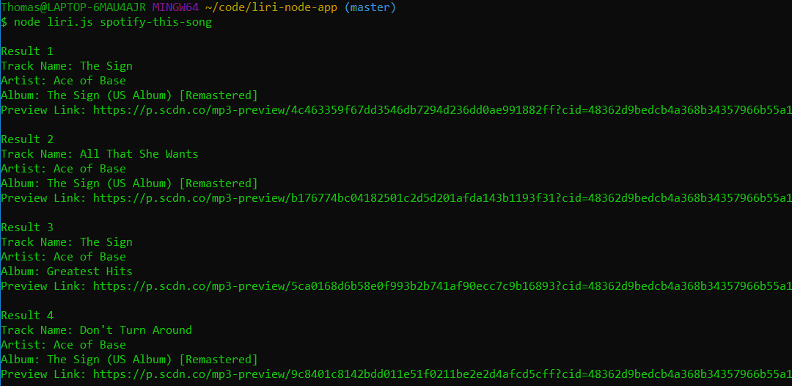
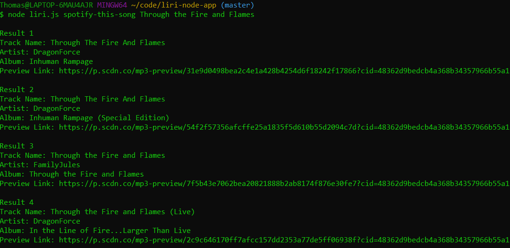
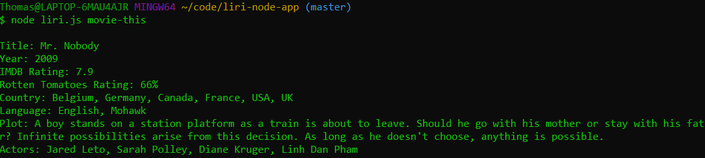
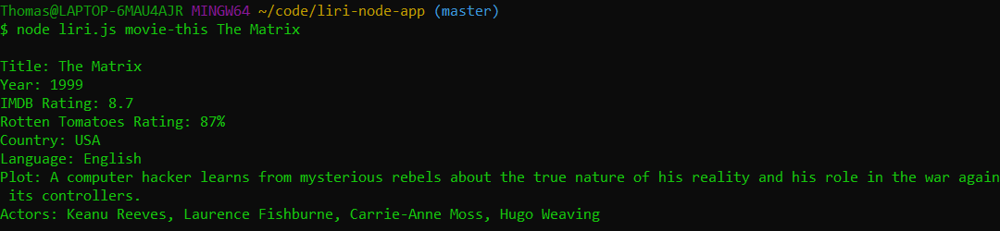

# Liri

# Table of Contents
* [About](#about)
* [Technologies](#technologies)
* [Requirements](#requirements)
* [Instructions](#instructions)
* [Twitter](#twitter)
* [Spotify](#spotify)
* [OMDB](#omdb)

# About
Liri is a node command-line application that interfaces with three different APIs - Twitter, Spotify, and OMDB - to provide data to the user.

# Technologies
* Node.js
* Twitter API
* Spotify API

# Requirements
* Node
* NPM
* Spotify and Twitter API Keys

# Instructions
1. Clone the repository.
2. You will need to provide your own API keys for Spotify and Twitter. Create a file called `.env` in the repository, and format it as in the image below. Place all six keys after the equals signs.

3. Run `npm i` (this will install the twitter, node-spotify-api, and request packages).
4. Run the application by typing `node liri.js my-tweets`, `node liri.js spotify-this-song`, or `node liri.js movie-this`.
5. Consult the sections below for examples of functionality.

# Twitter

If you run the application by typing `node liri.js my-tweets`, you will see a list of my tweets (mine, not yours) with timestamps, as shown below.

# Spotify

If you run the application by typing `node liri.js spotify-this-song`, you will see a list of Spotify search results for the song "The Sign" by Ace of Base, as shown below.

Alternatively, you can type `node liri.js spotify-this-song` followed by the name of a song to get results for that song, as shown below.

# OMDB

If you run the application by typing `node liri.js movie-this`, you will see movie data from OMDB for "Mr. Nobody", as shown below.

Alternatively, you can type `node liri.js movie-this` followed by the name of a movie to get data for that movie, as shown below.

